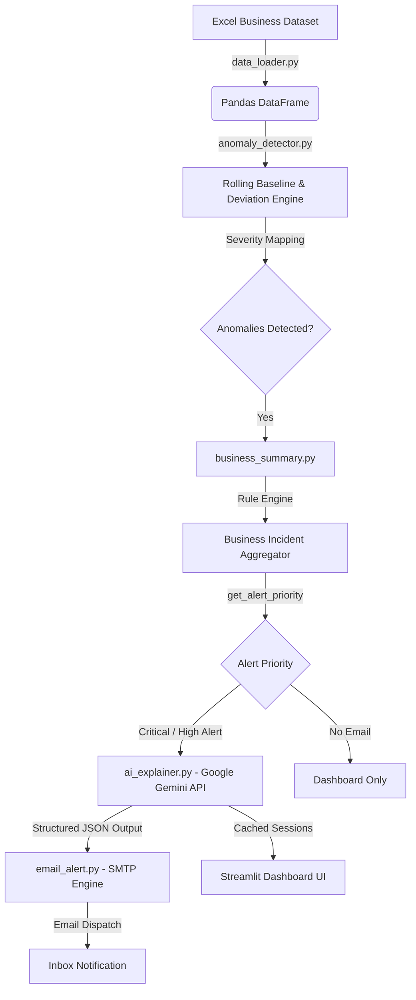

# 🚨 AI Anomaly Monitoring Agent

[](https://ai-anomaly-agent-zhnmy6jwxgnjvr5rmwzwqy.streamlit.app)

🌐 **Live Demo**: [ai-anomaly-agent-zhnmy6jwxgnjvr5rmwzwqy.streamlit.app](https://ai-anomaly-agent-zhnmy6jwxgnjvr5rmwzwqy.streamlit.app)

An intelligent, end-to-end business monitoring system that automatically detects unusual metric deviations, groups correlated anomalies into business incidents, generates AI-powered root-cause explanations using **Google Gemini**, sends automated email alerts, and presents insights via an interactive **Streamlit dashboard**.

---

## 📌 Project Overview

In fast-paced business environments, monitoring operational metrics like **Revenue, Conversion Rate, Traffic, Orders, Cost, and Refunds** manually across spreadsheets or static dashboards can lead to delayed incident response.

The **AI Anomaly Monitoring Agent** addresses this challenge by transforming raw operational data into actionable business intelligence:

```
[ Business Data ] ➔ [ Baseline & Anomaly Detection ] ➔ [ Incident Aggregation ]
                                                              │
                                       ┌──────────────────────┴──────────────────────┐
                                       ▼                                             ▼
                          [ AI Business Analysis ]                        [ Email Alerts ]
                                       │                                             │
                                       └──────────────────────┬──────────────────────┘
                                                              ▼
                                                 [ Streamlit Dashboard ]
```

---

## ✨ Key Features

- 📊 **Automated Time-Series Data Loading**: Ingests multi-metric business operational data from Excel/CSV formats with seamless date parsing.
- 📉 **Rolling Baseline Anomaly Detection**: Calculates a 7-day rolling window baseline to measure actual values against expected trends and flags significant percentage shifts.
- 🚥 **Severity Classification**: Categorizes detected anomalies into **Moderate** ($\ge 20\%$), **High** ($\ge 30\%$), and **Critical** ($\ge 50\%$) threshold breaches.
- 🧩 **Business Incident Engine**: Correlates multi-metric anomalies occurring on the same day (e.g., *Traffic UP + Conversion DOWN*, or *Revenue DOWN + Orders DOWN*) to identify root business issues rather than isolated metric spikes.
- 🤖 **Google Gemini AI Explainer**: Connects with the `gemini-3.6-flash` model to produce structured business insights covering:
  - **What Happened**: Clear summary of the metric anomaly.
  - **Possible Cause**: Nuanced potential drivers using probabilistic language (*may*, *could*).
  - **Business Impact**: Qualitative evaluation of operational or financial risk.
  - **Recommended Action**: Practical steps for business stakeholders.
- 🛡️ **AI Safety & Fact Guardrails**: Enforces strict prompt rules prohibiting unsupported ROI claims, assumed currencies, or hallucinated facts. Includes quota fallback handling.
- 📧 **Automated Email Notifications**: Dispatches formatted HTML/Text email alerts via SMTP for `CRITICAL ALERT` and `HIGH ALERT` priority incidents.
- 🖥️ **Interactive Streamlit Dashboard**: Provides dynamic KPI metric summary cards, interactive trend charts, severity/metric filter controls, anomaly tables, and expandable AI insight panels.

---

## 🏗️ System Architecture



---

## 📁 Project Structure

```text
ai-anomaly-agent/
│
├── data/
│   └── business_data.xlsx       # Sample 60-day business dataset
│
├── src/
│   ├── data_loader.py           # Dataset loading & date formatting module
│   ├── anomaly_detector.py      # Rolling average calculation & severity engine
│   ├── business_summary.py      # Anomaly explanation rules & incident aggregator
│   ├── ai_explainer.py          # Google Gemini AI integration & quota handler
│   └── email_alert.py           # SMTP email alerting service
│
├── app.py                       # CLI workflow execution & dataset generator
├── dashboard.py                 # Streamlit web application & visualization UI
├── .env                         # Environment variables (API keys & email config)
├── .gitignore                   # Git exclusion configuration
├── requirements.txt             # Project dependencies
└── README.md                    # Project documentation
```

---

## 🛠️ Tech Stack

- **Core Language**: Python 3.9+
- **Data Analysis & Processing**: Pandas, NumPy, OpenPyXL
- **AI & LLM Integration**: Google GenAI SDK (`google-genai`), Google Gemini API (`gemini-3.6-flash`)
- **Web Dashboard**: Streamlit
- **Alerting System**: Python `smtplib`, `email.mime`
- **Environment Management**: `python-dotenv`

---

## ⚙️ Installation & Setup

### 1. Clone the Repository
```bash
git clone https://github.com/ankurmittal9081/ai-anomaly-agent.git
cd ai-anomaly-agent
```

### 2. Create and Activate Virtual Environment
- **Windows**:
  ```bash
  python -m venv venv
  venv\Scripts\activate
  ```
- **macOS / Linux**:
  ```bash
  python3 -m venv venv
  source venv/bin/activate
  ```

### 3. Install Dependencies
```bash
pip install -r requirements.txt
```

---

## 🔑 Environment Configuration

Create a `.env` file in the root directory of the project:

```env
# Google Gemini API Key
GEMINI_API_KEY=your_google_gemini_api_key

# Email Alert Configuration (SMTP)
EMAIL_SENDER=your_email@gmail.com
EMAIL_PASSWORD=your_app_password
EMAIL_RECEIVER=recipient_email@gmail.com
```

> **Note**: If using Gmail for SMTP, generate an **App Password** from your Google Account security settings. Never commit your `.env` file to version control.

---

## ▶️ Usage & Execution

### Option A: Run Monitoring Pipeline (CLI)
Generate sample data, run anomaly detection, query Gemini AI, and trigger email alerts from the command line:

```bash
python app.py
```

### Option B: Launch Interactive Streamlit Dashboard
Launch the web interface for interactive monitoring and visualization:

```bash
streamlit run dashboard.py
```

After executing the command, open your browser at:
`http://localhost:8501`

---

## 📊 Detection Logic & Rules

### 1. Rolling Baseline Calculation
Anomalies are detected by comparing each day's actual value $V_t$ against a 7-day simple rolling average baseline $B_t$:

$$B_t = \frac{1}{7} \sum_{i=0}^{6} V_{t-i}$$

$$\Delta\% = \frac{V_t - B_t}{B_t} \times 100$$

An anomaly is flagged when $|\Delta\%| > 20\%$.

### 2. Severity Matrix

| Severity Level | Threshold Range ($|\Delta\%|$) | Description |
| :--- | :--- | :--- |
| **Moderate** | $20\% \le |\Delta\%| < 30\%$ | Minor metric deviation warranting monitoring |
| **High** | $30\% \le |\Delta\%| < 50\%$ | Significant metric shift impacting baseline |
| **Critical** | $|\Delta\%| \ge 50\%$ | Extreme deviation requiring immediate incident analysis |

### 3. Correlated Business Incident Rules

The engine groups co-occurring metric anomalies into high-level business issues:

- 🟢 **Traffic UP** + 🔴 **Conversion Rate DOWN**: Potential traffic-quality mismatch or campaign targeting issue.
- 🔴 **Revenue DOWN** + 🔴 **Orders DOWN**: Broader sales demand or conversion funnel drop.
- 🔴 **Cost UP** + 🔴 **Revenue DOWN**: Operational inefficiency or margin compression risk.
- 🔴 **Refunds UP**: Product quality defect or payment gateway error.

---

## 🤖 AI Business Analysis Example

When a critical business incident is flagged, Google Gemini synthesizes an executive summary:

```json
{
  "what_happened": "Traffic increased by 51.3% while conversion rate dropped by 48.0%, leading to a 22.9% drop in overall revenue.",
  "possible_cause": "This pattern may be caused by low-intent traffic driven by a recent ad campaign or landing page technical friction.",
  "business_impact": "Higher website traffic failed to convert into orders, resulting in lost revenue opportunities despite higher visitor volume.",
  "recommended_action": "Audit acquisition campaign sources, verify checkout performance, and review landing page user flow."
}
```

---

## 🔮 Future Roadmap

- 🔄 Real-time data streaming via Kafka / Webhooks.
- ⏰ Scheduled automated cron jobs for background execution.
- 💬 Multi-channel alerts (Slack, Microsoft Teams, PagerDuty).
- 📈 Machine learning anomaly detection (Isolation Forest / Prophet).
- 🔐 User authentication & role-based dashboard control.

---

## 👨‍💻 Author

**Ankur Mittal**  
*B.Tech in Computer Science & Engineering*

---

## 📄 License

This project is open-source and available under the [MIT License](LICENSE).
